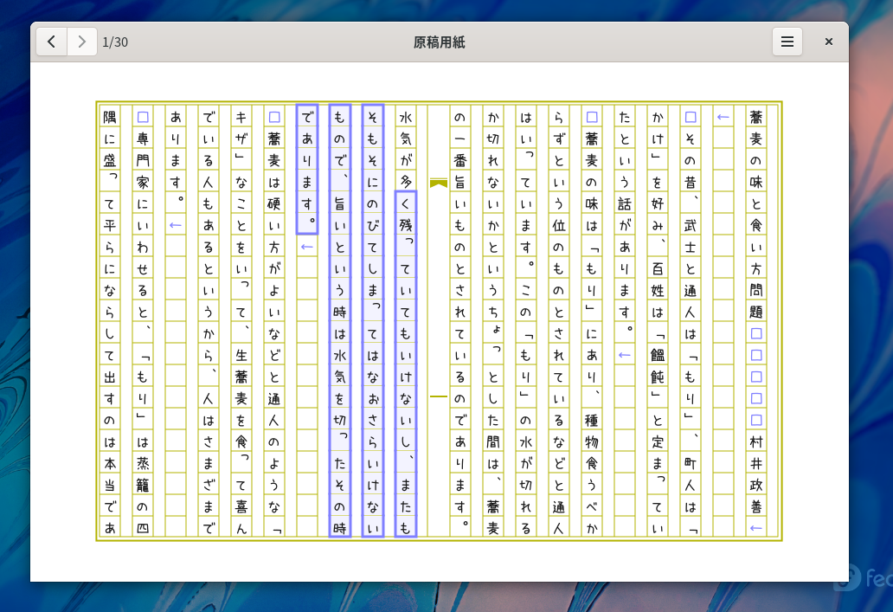

genkoyoshi
====================================================================================================
***CAUTION: It’s under construction! Do not use this application for professional use yet.***

GTK+3で、原稿用紙風のテキストエディタを作っていきます。

まだまだ始めたばかりなので、不足している機能や、バグなど多いです。
リリースするまではまるで使い物にならないと思ってください。

  
文：「蕎麦の味と食い方問題」村井政善・著
([ホームページ](https://www.aozora.gr.jp/cards/000312/card2036.html))  
フォント：「うずらフォント」([ホームページ](http://azukifont.com/font/uzura.html))

コンパイル・インストール・実行方法
----------------------------------------------------------------------------------------------------
`meson`コマンドを使ってビルドします。

依存関係はArch Linuxだと

* gcc
* gtk3
* libgee
* vala
* meson (>=0.58)
* ninja
* json-glib

Fedora (35)だと

* gtk3-devel
* vala
* meson
* libgee-devel
* libjson-glib-devel

Ubuntu (20.04)だと

* libgtk-3-dev
* vala
* meson
* libgee-0.8-dev
* libjson-glib-dev

※しかしUbuntuではmesonのバージョンが古い(0.53)ため、現在ビルドできません。
他の環境でコンパイルしてインストールした方が良さそうです。

コンパイル・インストール方法

    $ meson build --prefix=$HOME/.local
	$ cd build
	$ ninja
    $ ninja install

実行は下記のコマンドになります。

	$ com.github.aharotias2.genkoyoshi

(なお、`PATH`環境変数に実行ファイルがあるディレクトリが登録されているものとします)

作りたい機能
----------------------------------------------------------------------------------------------------
* 縦書き形文字 (句読点、括弧など)
* コピー、ペースト、切り取り
* アンドゥ、リドゥ
* ステータスバー
* ツールバーカスタマイズ
* コンテキストメニュー
* 設定画面
* ルビ機能
* 配色変更機能
* 文字コード判定・変換
* TEX・PDF出力
* テキスト保存機能
* 別名保存機能
* タブ表示
* 検索機能
* 置換機能
* ページジャンプ
* アウトライン機能

----------------------------------------------------------------------------------------------------

Copyright (C) 2021 田中喬之
